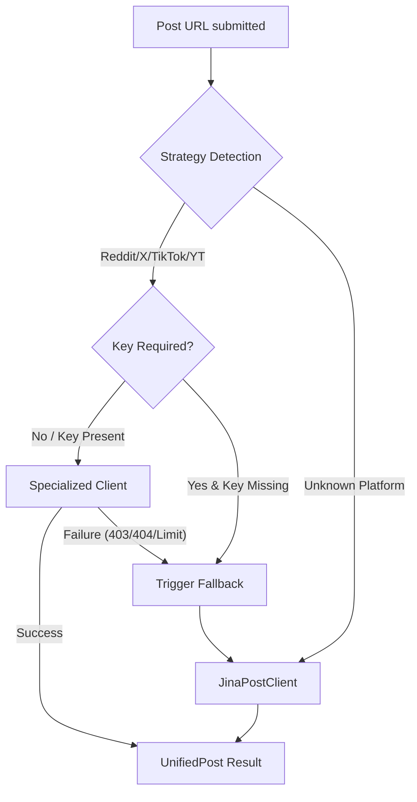

# Contributor notes

This document provides technical context and setup instructions for developers and contributors to the Postcard project.

## Environment setup

To set up the development environment, perform the following steps:

- **Clone the repository.**

  ```bash
  git clone https://github.com/postcardhq/postcard.git
  cd postcard
  ```

- **Install dependencies.**

  ```bash
  npm install
  ```

- **Install Playwright browsers.**
  Postcard requires specifically configured browser binaries for forensic scraping:

  ```bash
  npx playwright install
  ```

- **Configure environment variables.**
  Copy the template to create your local environment file:

  ```bash
  cp .env.example .env
  ```

  Edit `.env` to include your `GOOGLE_GENERATIVE_AI_API_KEY` if you plan to use the live pipeline.

- **Initialize the database.**
  Sync the schema to your local SQLite file:

  ```bash
  npm run db:push
  ```

  You can inspect your local forensic audit logs visually at any time using:

  ```bash
  npm run db:studio
  ```

- **Verify the environment.**

  ```bash
  npm run check  # Run linting and type-checks
  ```

- **Start the development server.**
  ```bash
  npm run dev
  ```

## System testing

Postcard includes a comprehensive test suite for verifying ingestion strategies and forensic pipelines.

- **Run all automated tests.** `npm run test`
- **Run in UI mode.** `npx playwright test --ui`

The test suite automatically utilizes the `fake` project configuration to ensure consistent results without consuming AI API credits during local verification.

### Manual verification checklist

To verify the forensic pipeline and dynamic UI components manually, follow these scenarios:

1.  **Forensic pipeline hardening.**
    - Navigate to `/postcards`.
    - Submit a URL containing the word **"fail"** (e.g., `https://x.com/user/status/fail-test`).
    - **Expected.** The airmail animation starts immediately, followed by a "failed" state with an error message and stopped polling.

2.  **Dynamic social cards (OG images).**
    - Complete any analysis and copy the **Postcard ID** from the URL.
    - Visit `/api/postcards/[ID]/og`.
    - **Expected.** You see a rendered PNG image with a vintage "Forensic Report" aesthetic, dynamic score stamp color, and verdit text.

3.  **Public API lifecycle (202 Accepted).**
    - Trigger a new trace using `POST /api/postcards` with JSON `{"url": "..."}`.
    - Immediately poll using `GET /api/postcards?url=...`.
    - **Expected.** Returns **HTTP 202 Accepted** while processing, followed by **HTTP 200 OK** with the full report object once complete.

4.  **Agent throttling.**
    - In `.env`, set `POSTCARD_MAX_TOOL_CALLS=2`.
    - Run a live (non-fake) trace.
    - **Expected.** The agent stops searching after exactly 2 tool executions. Verify this in the **Corroboration Log** in the report UI.

## Internal documentation

- **Live demo.** [postcard.fartlabs.org](https://postcard.fartlabs.org)
- **Hosted docs.** [Mintlify](https://www.mintlify.com/postcardhq/postcard)
- **OpenAPI.** [openapi.json](../public/openapi.json)

When contributing new features, ensure that the corresponding documentation is updated in the `docs/` folder and that any API changes are reflected in the OpenAPI specification.

## Project configuration

Postcard supports two primary development modes, toggled via the `NEXT_PUBLIC_FAKE_PIPELINE` environment variable in your `.env` file.

- **Fake mode (`true`).** Uses mock data for all forensic stages. No Gemini API key or external scraping is required. This is the default for rapid UI/UX development.
- **Live mode (`false`).** Executes the full forensic pipeline (OCR, Navigator, Auditor, Corroborator). Requires a valid Gemini API key stored in a browser cookie (`postcard_api_key`).

### Specialized ingestion keys (optional)

To improve ingestion reliability for platforms that often restrict generic scrapers, you can provide the following optional keys in your `.env`:

- **Instagram.** Add `INSTAGRAM_ACCESS_TOKEN` from your [Meta for Developers](https://developers.facebook.com/) app.
- **Reddit.** Add `REDDIT_CLIENT_ID`, `REDDIT_CLIENT_SECRET`, `REDDIT_USERNAME`, and `REDDIT_PASSWORD` for authenticated API access.

If these keys are omitted, Postcard gracefully falls back to Jina Reader for best-effort ingestion.

### Ingestion strategy logic



## Database management

Postcard uses Drizzle ORM with libSQL (SQLite) and [Turso](https://turso.tech). By default, it uses a local SQLite file (`local.db`) for rapid development.

### Turso cloud setup (remote database)

To connect to a remote Turso database for production or cloud testing:

- Create a free account at [turso.tech](https://turso.tech) and install the Turso CLI.
- Create a new database: `turso db create postcard-db`.
- Get the database URL: `turso db show postcard-db --url`.
- Generate an auth token: `turso db tokens create postcard-db`.
- Add these values to your `.env` as `TURSO_DATABASE_URL` and `TURSO_AUTH_TOKEN`.
- Apply your schema: `npm run db:push`.

## Technology stack

Postcard utilizes a modern stack designed for forensic performance and developer velocity.

| Layer         | Choice                   | Why                                                              |
| ------------- | ------------------------ | ---------------------------------------------------------------- |
| Frontend      | Next.js 16               | Provides a responsive dashboard and high-performance API routes. |
| AI / Vision   | Google Gemini            | Enables native multimodal vision and search grounding.           |
| Orchestration | Vercel AI SDK v6         | Supports robust tool calling and typed stream iteration.         |
| Storage       | Drizzle + libSQL (Turso) | Ensures type-safe libSQL persistence for forensic logs.          |
| Automation    | Playwright / sharp       | Handles headless scraping and image preprocessing.               |

## Documentation style guide

To maintain a professional and consistent technical narrative, all documentation must follow these standards:

### Sentence case titles

Use sentence case for all headings and titles (e.g., "What it does" instead of "What It Does"). Only capitalize proper nouns like "Postcard", "Next.js", or "Vercel".

### Active voice

Prioritize active voice in all technical descriptions. Identify the actor and the action clearly.

- **Good:** "The preprocessor enhances the image."
- **Bad:** "The image is enhanced by the preprocessor."
